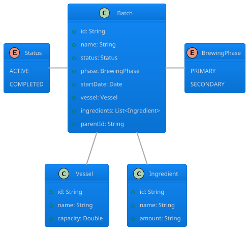

Ferment: A Mobile App for Home Brewers And Fermentation Enthusiasts
===

A mobile application for kombucha enthusiasts to track their brewing process on the go.
This interactive mobile tracker helps users manage multiple batches of kombucha throughout their fermentation journey directly from their smartphones.
An essential tool for kombucha brewers who want to maintain detailed records of their fermentation processes

## Key Features

* Track both primary and secondary fermentation stages from anywhere
* Monitor batch duration with automatic time calculations
* Record ingredients for each fermentation stage with a mobile-optimized input interface
* Create relationships between batches with parent-child connections
* Add a brewing vessel and set it to a batch 
* Split batches to track derivatives with just a few taps
* Convert primary fermentation to secondary fermentation seamlessly
* Mark batches as complete or reactivate them as needed
* Store batch data locally on the device for persistent tracking

## User Interface Requirements

* Touch-optimized mobile interface with Material design
* Two tabs: active and completed batches
* Compact card view showing each brew
* Simplified detail forms for adding and editing batch information on smaller screens
* Touch-friendly confirmation dialogs for important actions like deletion
* Duration display showing both total time and breakdown of fermentation stages
* Bottom navigation for easy access to different app sections

## Technical Specifications

* Built with Kotlin for cross-platform mobile compatibility
* Utilizes Kotlin Compose UI components for consistent styling across devices
* Implements local database storage for offline data persistence
* Form validation for required fields with mobile-friendly error messages
* Designed for various phone screen sizes
* Push notification support for fermentation timing reminders

### Data model

